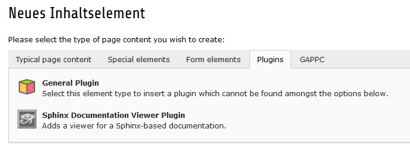
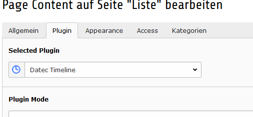

.. ==================================================
.. FOR YOUR INFORMATION
.. --------------------------------------------------
.. -*- coding: utf-8 -*- with BOM.

.. include:: ../../Includes.txt

.. _admin-manualDE:

Administrator Handbuch
======================

Zielgruppe: **Administratoren**

.. only:: html

	.. contents:: Auf dieser Seite
		:local:
		:depth: 3

Anforderungen
-------------

.. caution::
	Es muss das JQuery Javascript Framework und JQuery-UI Plugin selbst installiert werden.

Installation
------------

1) Erweiterung über den Erweiterungsmanager runterladen und installieren (extKey: datec_timeline)
2) Fügen Sie einen Speicherordner für die Termine hinzu, notieren Sie sich die Seiten ID (PID) des Ordners
3) Gehen sie in das Konfiguration Kapitel dieses Handbuches und übernehmen die erforderlichen Einstellungen
4) Fügen sie das Plugin wie beschrieben hinzu
5) (optional) Fügen Sie für die Erinnerungsmail einen neuen Task zu ihrem Planer hinzu

Plugin hinzufügenInsert Plugin
------------------------------

1) Fügen Sie ein neues Inhalts Element hinzu, wechseln dort auf den Reiter Plugins und wählen dort Generelles Plugin hinzu

	Hinzufügen eines Inhalt Elements vom Typ "Plugin"

2) Wählen Sie das Plugin "Datec Timeline" aus.

	Wählen der Ansichts Form

3) (Optional) Setzen der benötigten Zugriffsrechte die Termine sollten nur für bestimmte Benutzergruppen verfügbar sein.

Hinzufügen von eines Errinerungsemail Task
------------------------------------------

1) Gehen Sie in das BE-Modul Planer (die Planer Erweiterung muss installiert und konfiguriert sein)
2) Fügen Sie einen neuen Aufgaben Task mit dem Namen "Datec Timeline - Reminder e-mails task" hinzu
3) Es ist empfohlen als auf täglich wiederholend (86400 seconds) und die Ausführungszeit auf 0:00 zu stellen
4) Hinweis die Sprache der Email hängt von der Sprache es _cli_scheduler backend Benutzers ab