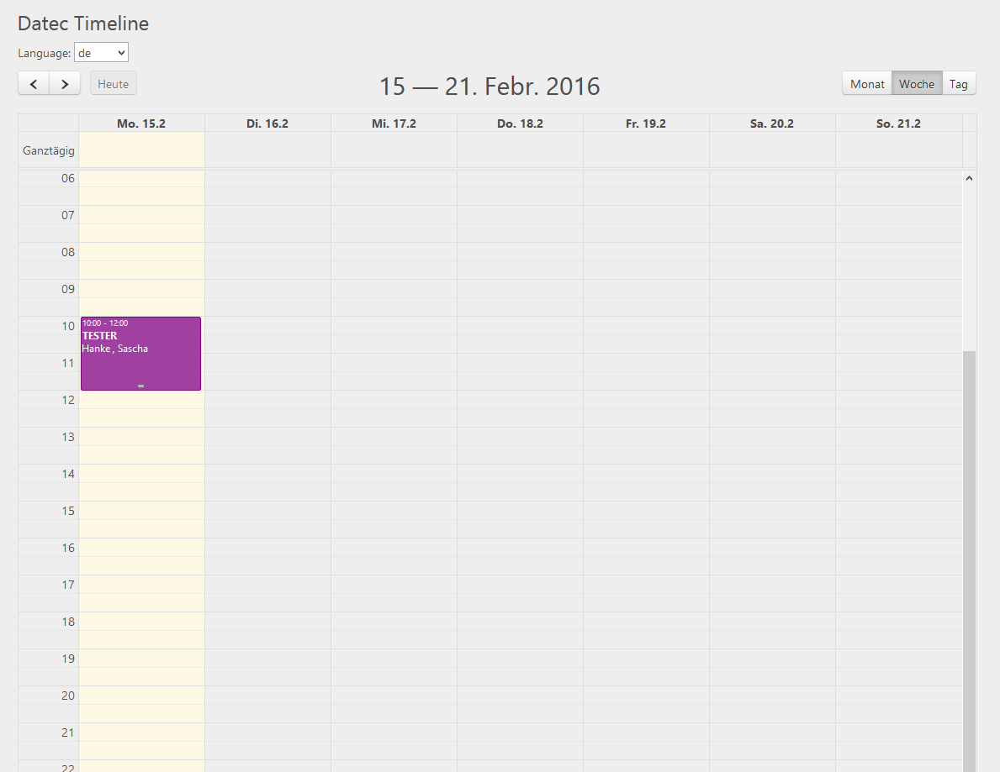

.. ==================================================
.. FOR YOUR INFORMATION
.. --------------------------------------------------
.. -*- coding: utf-8 -*- with BOM.

.. include:: ../../Includes.txt

.. _introductionDE:

Was macht es?
================

Diese Erweiterung enthält ein Model für das einfache Planen von Terminen. Die Frontend Lösung ist JQuery fullcalendar, es muss JQuery und JQuery-UI installiert sein.
Diese Frontend Erweiterung basiert auf der FullCalendar funktionalität, in Kombination mit dem Terminplan Objekt, es ist perfekt für das Planen von Terminen mit mehreren Teilnehmern.

* Kalender und Agenda Ansicht pro Monat, Woche oder Tag
* Termine können in der Frontend Ansicht bearbeitet werden
* Einfaches Verschieben der Termine durch Drag&Drop
* Termine haben einen Titel, eine Beschreibung, Ersteller oder Teilnehmer aus den Frontend Benutzern und ein Erinnerungsdatum
* Zugriff auf die Plugin Feature können über die Zugriffsrechte des Plugin Content Elements gesteuert werden
* Die Frontend Ansicht ist für das Responsiv Design optimiert und mit Bootstrap 3 getestet
* Frontend-Benutzer werden als Ersteller und Teilnehmer eingesetzt.

.. tip::

	Besuchen & unterstützen Sie uns: `<https://github.com/theorak/datec_timeline>`_

.. tip::

	Mehr Informationen zu fullcalendar: `<http://fullcalendar.io/>`_

	Datec Timeline kurz nach der Installation
